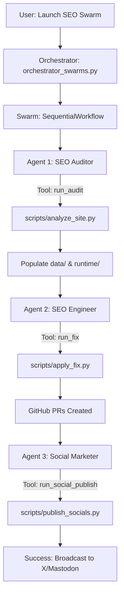

# 🚀 SEO Command Center: Autonomous Swarm Orchestration

Welcome to the **SEO Command Center** (aka `SEO_Improve-Hermes`), a state-of-the-art autonomous agentic system designed to revolutionize website optimization. 

This system doesn't just find SEO gaps—it **fixes them autonomously**. It audits sites, writes code, manages GitHub Pull Requests, and broadcasts your growth markers across social media platforms.

---

## 🏗️ Project Workflow

The system operates using a modular "Agentic" architecture, where specialized LLM-powered agents coordinate through a central dashboard.



---

## ✨ Key Features

- **🔍 Autonomous SEO Auditing**: Deep crawls using `BeautifulSoup` combined with LLM analysis to identify high-impact technical gaps.
- **🛠️ AI-Powered Engineering**: Automatically clones repositories, creates isolation branches, patches code via regex/LLM, and submits GitHub PRs.
- **📢 Social Growth Broadcasting**: Generates and posts "Build in Public" updates to **X (Twitter)** and **Mastodon** to boost domain authority via social signals.
- **🖥️ Command Center Dashboard**: A premium Streamlit interface to monitor agents in real-time.

---

## 🛠️ Installation & Setup

Follow these steps to get your SEO Swarm running locally:

### 1. Prerequisites
- Python 3.9+
- Git installed and configured
- A GitHub Personal Access Token (with `repo` scope)

### 2. Clone the Repository
```bash
git clone https://github.com/tirthpatel143/SEO_Improve-Hermes.git
cd SEO_Improve-Hermes
```

### 3. Environment Configuration
Copy the example environment file and fill in your API keys:
```bash
cp my-seo-improve/.env.example my-seo-improve/.env
```
Ensure the following keys are present:
- `GEMINI_API_KEY`: Intelligence for audits.
- `GITHUB_TOKEN`: For automated PR management.
- `X_API_KEY`: For social broadcasting.
- `MASTODON_ACCESS_TOKEN`: For Mastodon integration.

### 4. Install Dependencies
```bash
pip install -r requirements.txt
# If requirements.txt is missing, install core libs:
pip install streamlit beautifulsoup4 openai google-generativeai python-dotenv swarms
```

---

## 🚀 How to Use

### Launching the Dashboard
The primary way to interact with the system is through the **SEO Command Center Dashboard**:
```bash
cd my-seo-improve
streamlit run dashboard/app.py
```

### Running the Autonomous Swarm
You can trigger the full autonomous loop directly via the orchestrator:
```bash
python scripts/orchestrator_hermes.py
```

---

## 🐝 The Swarm: Agent Roles

| Agent | Role | Ethos |
| :--- | :--- | :--- |
| **SEO Auditor** | Technical Analysis & Strategy | Meticulous, Data-Driven |
| **SEO Engineer** | Code Implementation & Git Ops | Precise, Safety-First |
| **Social Marketer** | Content & Broadcasting | Engaging, Transparent |

---

## 📁 Directory Structure

| Path | Description |
| :--- | :--- |
| `dashboard/` | Streamlit-based UI for monitoring and control. |
| `scripts/` | Core logic for site analysis, code patching, and social posting. |
| `data/` | Persistent storage for SEO strategies and product info. |
| `runtime/` | Working directory for cloned repos and generated reports. |
| `hermes-agent/` | The core agentic framework and skill definitions. |

---

## 📜 License
Distributed under the MIT License. See `LICENSE` for more information.

---
*Built with ❤️ by the Hermes Agent Swarm.*
