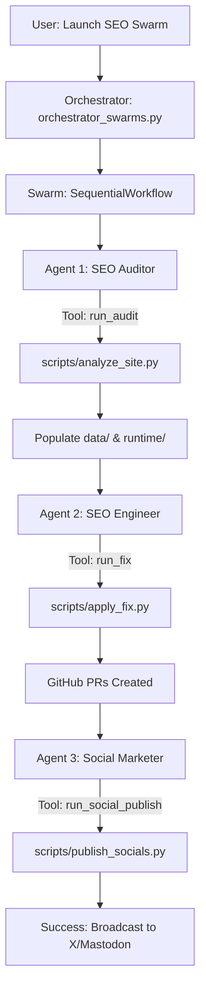

# 🚀 SEO Command Center: Documentation & Workflow

Welcome to the **SEO Command Center** (aka `my-seo-improve`), an autonomous agentic orchestration system designed to audit websites, identify technical SEO gaps, automatically deploy code fixes to GitHub, and broadcast marketing signals across social platforms.

---

## 🏗️ Project Architecture

The system is built with a modular "Agentic" approach, where a central dashboard orchestrates specialized Python scripts and an LLM-powered agent (Hermes).

### 🔄 Swarm Orchestration Flow



---

## 📁 File Structure

| Path | Purpose |
| :--- | :--- |
| `dashboard/app.py` | **The Brain.** Streamlit-based UI for monitoring and control. |
| `scripts/orchestrator_swarms.py` | **The Swarm.** Multi-agent orchestration using the Swarms framework. |
| `scripts/analyze_site.py` | **The Auditor Tool.** Scrapes the target site and generates the SEO roadmap. |
| `scripts/apply_fix.py` | **The Engineer Tool.** Clones repos, patches code, and manages GitHub PRs. |
| `scripts/publish_socials.py` | **The Marketer Tool.** Handles API calls to X, Mastodon, and LinkedIn. |
| `data/` | Persistent storage for strategy, product info, and scraped data. |
| `runtime/` | Working directory for cloned repositories and generated reports. |
| `hermes-agent/` | The core agentic framework and skill definitions. |

---

## 💻 Core Source Code

### Dashboard (`dashboard/app.py`)
This is the Streamlit interface that coordinates the entire workflow.
```python
import streamlit as st
import json
import os
import subprocess
import sys
# ... (imports)

# Main action: Run Audit
if st.button("🔍 Run New Audit"):
    result = subprocess.run([sys.executable, "scripts/analyze_site.py", target_url])

# Main action: Launch Hermes AI
if st.button("🤖 Launch Hermes AI"):
    result = subprocess.run([sys.executable, "scripts/orchestrator_hermes.py"])
```

### Auditor (`scripts/analyze_site.py`)
Scrapes the site and uses LLMs to generate the roadmap.
```python
def scrape_and_analyze(url):
    # Scrapes Title, Meta, H1s, etc.
    # Calls OpenAI/Gemini to generate JSON roadmap
    # Saves results to data/ and runtime/outputs/
```

### Agent (`scripts/orchestrator_hermes.py`)
Initializes the Hermes agent and runs the autonomous implementation loop.
```python
def run_daily_workflow():
    agent = AIAgent(...)
    prompt = f"Scan local codebase for SEO gaps... use apply_fix.py to patch..."
    agent.chat(prompt)
```

### Engineer (`scripts/apply_fix.py`)
The utility that handles Git operations and code patching.
```python
def apply_github_fix(action_id, action_title, repo_url):
    # Clone repo -> Create Branch -> Inject Code -> Push -> Create PR
```

---

## 🛠️ How it Works (Step-by-Step)

### 1. The Intelligence Phase
When you run a **New Audit**, `analyze_site.py` uses `BeautifulSoup` to extract the current SEO state. It then feeds this "Current State" into an LLM (OpenAI or Gemini) to generate:
- A **Growth Strategy** (Targeting ICPs).
- **Product Intelligence** (Unique value props).
- **Technical Tasks** (Specific code snippets to fix gaps).

### 2. The Implementation Phase
The **Hermes AI** (`orchestrator_hermes.py`) takes the generated strategy and starts a loop. It:
1. Locates the relevant file in your project (e.g., `layout.tsx`).
2. Calls `apply_fix.py`.
3. `apply_fix.py` clones your GitHub repo into `runtime/`, creates an isolation branch (e.g., `seo-fix-a1`), and uses regex or string replacement to inject the "Optimized Code".

### 3. The Deployment Phase
Once the code is patched, the system uses your `GITHUB_TOKEN` to push the branch and **automatically create a Pull Request (PR)**. This allows you to review the AI's changes before they hit production.

### 4. The Growth Phase
Finally, `publish_socials.py` generates platform-specific "Building in Public" updates and posts them to **X (Twitter)** and **Mastodon** using their respective APIs, creating social signals that boost your domain authority.

---

## 🔑 Environment Variables
To run this project, ensure your `.env` contains:
- `GEMINI_API_KEY`: For audit intelligence.
- `GITHUB_TOKEN`: For pushing fixes (needs `repo` scope).
- `X_API_KEY / SECRET`: For social publishing.
- `MASTODON_ACCESS_TOKEN`: For Mastodon posting.
